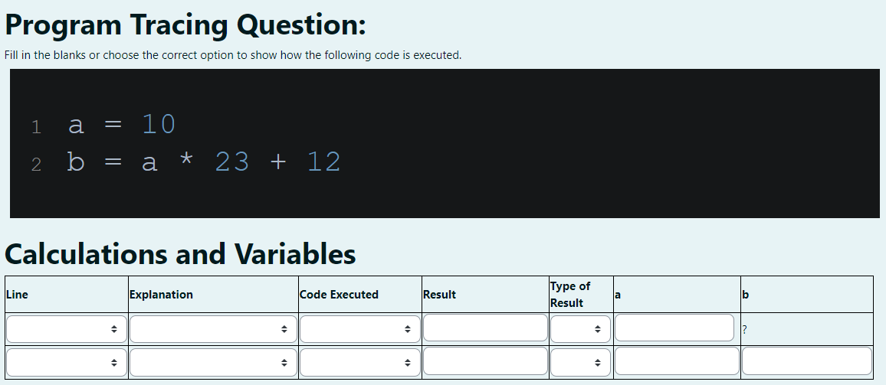
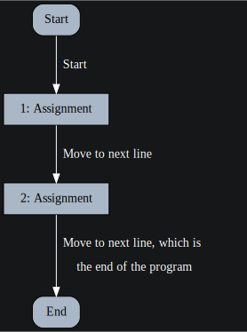
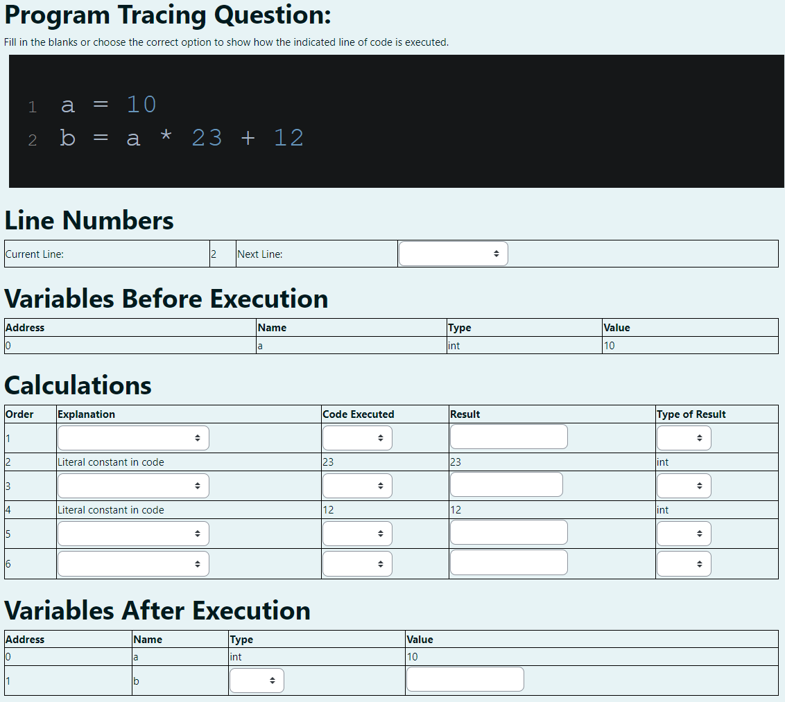
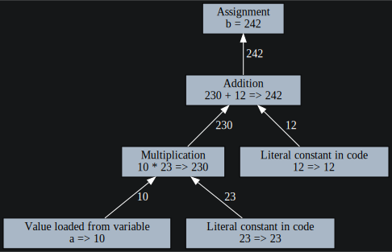
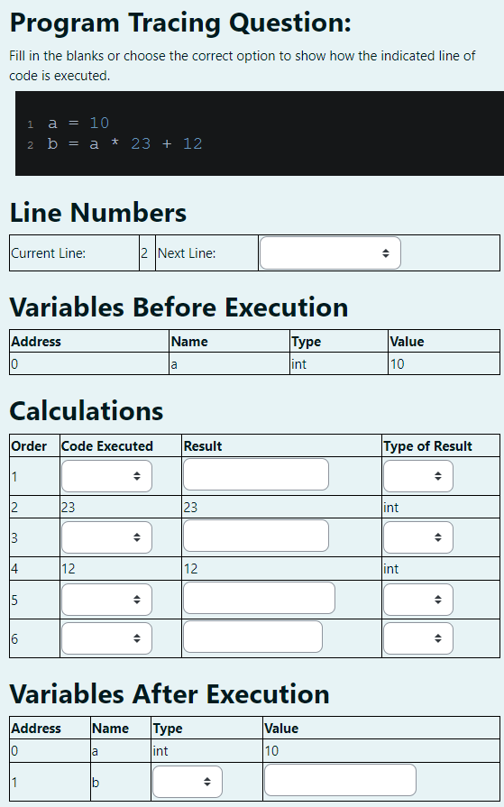
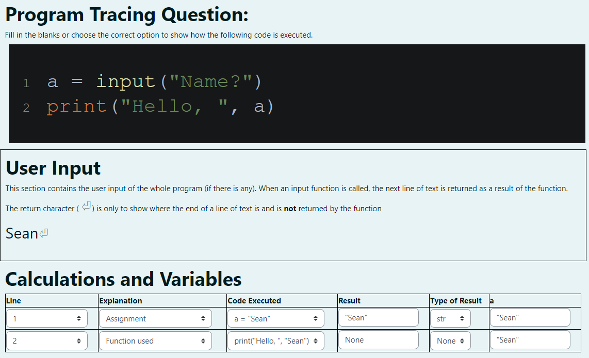
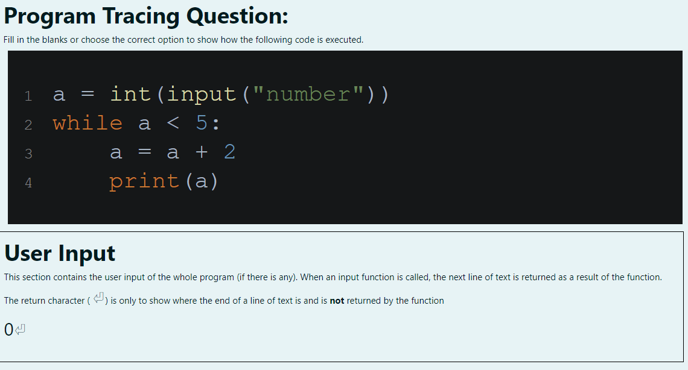
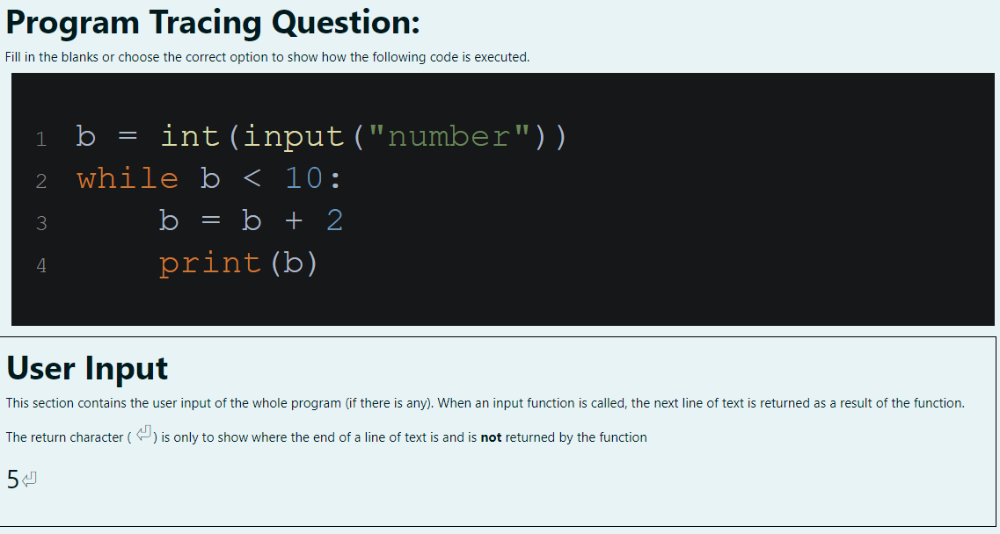
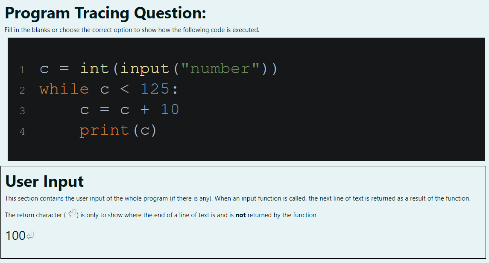

# Moodle Trace Generator
Moodle trace generator is a command line utility for generating code tracing exercises which can be imported as moodle cloze questions. Questions can be focused on a single simple statement, or at a higher level on a number of statements.

## High Level Questions
Generating questions at a high level about overall execution of the code and changes to the variables is the default behaviour. This can be achieved with the following command.
```
python3 main.py example.py
```

If the contents of the file `example.py` are the following, then the question below will be generated. 
```python
a = 10
b = a * 23 + 12
```

### The Generated Question


This type of question is suitable for use reinforcing students knowledge of the flow of control in programs. Default behaviour is to award points for correct variable values (at the point of change), correct sequence of line execution, evaluation of expressions and determination of type. Many of these are choosen from options in a drop-down menu, while calculation result and values of variables must be typed by the students.

### The Generated Feedback
For the default settings, the following flowchart is displayed after the question is submitted. It is a very basic generated representation of the steps that the program executes in order.



### Animated Feedback
By adding the command line flag `-a` the above feedback is replaced with an animated representation of the same, with a represenation of the code and a redementary symbol table.




## Low Level Questions
To generate low-level questions we can add the command line flag `-i` or `--individual`. This causes the generation of individual questions for each line of code. These questions focus on the execution order of expressions within the statement. 

```
python3 main.py example.py -i
```
### The Generated Question
This question is generated based on the second line of code in the example.py above.



All inputs except the result and value columns are choosen from drop-down boxes, while these must be typed by the student. 

### The Generated Feedback
For the default settings, the following image is displayed after the question is submitted. It is a very basic generated representation of the AST for that line of code. This image is accompanied with a block of text explaining the ordering of the operations. 




### Animated Feedback
By adding the command line flag `-a` the above feedback is replaced with an animated representation of the same. Little is changed, but nodes in the tree are highlighted in sequence and results are animated travelling up the tree in sequence. 


### Selecting Questions
When generating low-level questions we can choose to generate only questions for specific lines within the input file. This allows us to ignore the basic and setup code that prefaces the important code in our file. This is done using the `-o` or `--only` command line flag followed by a comma separated list of the lines that questions should be generated for. 
```
python3 main.py example.py -i -o 3,4
```
This example would generate questions only for lines 3 and 4 of the input code. 

### Removing Explanation

This type of question can be simplified slightly by removing the explanation column. This if done by adding the `-r` or `--reduced` command line flag when generating the questions. In essence this makes little difference to the question, but reduces the number of input operations required by the student.



### Limitations
The questions generated at this level have some limitations:
- Addresses generated (where appropriate) are not representative of the size or allocation technique actually used in the languages
- The order of evaluation of expressions is based on how the expression would be evaluated if the values were all functions. As such no optimisation of variable loading or other type is done.
- Lazy evaluation is not yet implemented (it is on the TODO list)

## User Input
If the code contains user input, this must be supplied in a supplementary file. The format of the file is a JSON dictionary where the input is a string and the key is `"0"`. This process is done using the command line flag `-s` or `--stdin` followed by the name of the file containing the input dictionary. (Note the dictionary is used to more easily accomodate the techniques used in the next section)

File: `example2.py`
```python
a = input("Name?")
print("Hello, ", a)
```
File: `example2.json`
```json
{ "0" : "Sean" }
```
Command:
```
python3 main.py example2.py -s example2.json
```
The above combination of files and command would generate the following question:


An additional section is included to show the contents of the input file and the values in the program are also altered based on the contents of the file.

## Template Questions
The primary utility of this generator is the ability to generate a large number of questions from a single template. This can be done with both high and low level questions. This functionality relies on the format method in the Python string class. 

Consider the following code which we will convert into a template:
```python
a = 0
while a < 5:
    a = a + 2
	print(a)
```
We can replace the variable names as well as the literal values used in the code and even operators (though this can make it more difficult to ensure questions are isomorphic). 

Lets consider how to change this template so that students will have different variable names. Firstly, we want the same value used every place there is currently an `a`, so we should use index formatting. We can additionally replace the 3 literal values with parameters. This gives us the code below.

```python
# This is example3.py
{0} = {1}
while {0} < {2}:
    {0} = {0} + {3}
	print({0})
```

In order to produce questions using this code we must use the `-p` or `--parameter` command line flag followed by the name of a file containing the value we wish to be used. Here the values being used to format the code are contained in the file `example3.pm` (shown below). Each line must contain a value for each of the wildcards in the template, and questions will be generated for each line in the parameters file.
```
a 0 5 2
b 5 10 2
c 100 125 10
```
If we execute the command `python3 main.py example3.py -p example3.pm` then questions will be generated about the following segments of code.
<table>
<tr>
<th>First line</th>
<th>Second line</th>
<th>Third line</th>
</tr>
<tr>
<td>

```python
a = 0
while a < 5:
    a = a + 2
    print(a)
```
</td>
<td>

```python
b = 5
while b < 10:
    b = b + 2
    print(b)
```
</td>
<td>

```python
c = 100
while c < 125:
    c = c + 10
    print(c)
```
</td>
</tr>
</table>

### Combining Templates and Input
When combining templates with input, the process is much the same. However, rather than the intput for a question being stored in the dictionary using the key `"0"`, it is stored using the 0 indexed count of the parameter input line. 

For example, the following code template:
```python
# This is example4.py
{0} = int(input("number"))
while {0} < {1}:
    {0} = {0} + {2}
	print({0})
```
Could be combined with the following parameter file (`example4.pm`):
```
a 5 2
b 10 2
c 125 10
```
And the following input file (`example4.in`):
```json
{
  "0" : "0",
  "1" : "5",
  "2" : "100"
}
```
If we execute the command `` then questions will be generated about the following segments of code.
<table>
<tr>
<th>First line</th>
<th>Second line</th>
<th>Third line</th>
</tr>
<tr>
<td>

```python
a = int(input("number"))
while a < 5:
    a = a + 2
    print(a)
```
</td>
<td>

```python
b = int(input("number"))
while b < 10:
    b = b + 2
    print(b)
```
</td>
<td>

```python
c = int(input("number"))
while c < 125:
    c = c + 10
    print(c)
```
</td>
</tr>
<tr>
<td>


</td>
<td>


</td>
<td>


</td>
</tr>
</table>

## Other Options

### Generating Both Question Types
Questions can be generated simeltaneously at high and low levels by using the `-b` or `--both` command line flags. 


### Naming Questions
Using the command line flags `-n` or `--name` followed by a token allows the preface of the name of all generated questions to be set. If multiple questions are generated, additional characters will be added to distinguish different questions.
```
python3 main.py example.py -n basic-assignment
```

### Different Languages
Moodle trace generator currently supports only C and Python. The default is Python, but C can be used with the addition of the command line flag `-l` or `--lang`.

```
python3 main.py example.c -l C
```

### Managing Collections of Questions
Moodle allows the management of questions in banks through categories. Using the `-c` or `--category` command line flag allows the generated questions to be automatically placed within a category of you choice when imported. 

```
python3 main.py example.c -c quiz1/assignment
```

### Displaying Additional Questions
By default constants within the code are included wihtin the question in the correct position to reduce the requirements of the questions. This behaviour can be suppressed using the `-d` or `--display` command line flags. 